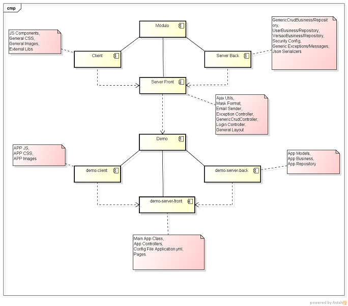

#Módulo

```
POM geral onde configura os repositories, pluginRepositories e distributionManagement.
```
E os módulos:

  - Client
  - Server Back
  - Server Front
  - Tests

##Client

Todas as tarefas são orquestradas pelo plugin do maven frontend-maven-plugin que realiza as seguintes tarefas:

  - install node and npm
    - Faz o download do node e npm para a pasta node.
  - npm install
    - Executa o install do npm, ou seja instala as dependências do arquivo *package.json*, como descrito abaixo.
  - bower install
    - Executa o install do bower, ou seja instala as dependências do arquivo *bower.json*, como descrito abaixo.
  - gulp less
    - Executa a tarefa optimize-and-copy-less do arquivo gulpfile.js.
    - Pega todos os arquivos da pasta *src/less*, gera um sourceMap\* para cada arquivo, transpila para CSS\*\*, minifica e copia para a pasta */dist/css*.
  - gulp less components
    - Executa a tarefa optimize-and-copy-less-components do arquivo gulpfile.js.
    - Pega todos os arquivos da pasta *src/less/components*, gera um sourceMap\* para cada arquivo, transpila para CSS\*\*, minifica, concatena todos os arquivos no arquivo **components.css** e copia para a pasta */dist/css*.
  - gulp copy-assets
    - Executa a tarefa copy-assets do arquivo gulpfile.js.
    - 
  - gulp optimize-and-copy-css
  - gulp copy-components
  - gulp copy-bower-libs
  - gulp copy-images

No final é gerado um jar com todo o conteúdo da pasta dist, um WebJar.

####NPM

  Usado para instalar o Bower, Gulp e os módulos do gulp.

####Bower

  - Gerenciador de dependências para front-end, nele são instaladas as bibliotecas externas da aplicação:
    - awesome-bootstrap-checkbox
    - bootstrap
    - bootstrap-confirmation2
    - bootstrap-datepicker
    - bootstrap-table
    - bootstrap-timepicker
    - bootstrapvalidator
    - font-awesome
    - jquery
    - jQuery-Mask-Plugin
    - knockout
    - metisMenu
    - remarkable-bootstrap-notify
    - screenfull
    - typeahead.js

####Gulp

- Realiza tarefas de otimização dos arquivos de CSS, LESS, JS e IMG através dos módulos:
  - gulp-changed
  - gulp-concat
  - gulp-imagemin
  - gulp-less
  - gulp-minify-css
  - gulp-sourcemaps
  - gulp-uglify
  - imagemin-pngcrush
  - main-bower-files

####Less
####Knockout

##Server Front

####ExceptionController
####ServletInitializer
####LoginController
####ModuloEmailSender
####MaskFormat


##Server Back

###br.com.mv.geral.controleacesso.authentication.util
#####PasswordEncoderImpl
###br.com.mv.modulo.business
#####UserBusiness
#####VersaoBusiness
###br.com.mv.modulo.config
#####CacheConfig
#####DatabaseConfig
#####SecurityConfig
###br.com.mv.modulo.exception
#####GenericException
#####GenericMessages
###br.com.mv.modulo.model
#####JSON
###br.com.mv.modulo.model.type
#####EnumTipoMensagem
#####TipoUsuario.java
###br.com.mv.modulo.repository
#####UserRepository
#####VersaoRepository
###org.springframework.data.convert
#####JsonBooleanDeserializer
#####JsonDateDeserializer
#####JsonDateSerializer


##Tests
 Esse módulo fornece todas as dependências necessárias para testar as aplicações:

  - spring-security-test
  - selenium-htmlunit-driver
  - spring-boot-starter-test

####TestsConfig
####WebDriverTestsConfig
####AbstractPage


#Classes Genéricas que facilitam a contrução de CRUDS:

##GenericCrudController

   Classe abstrata com métodos padrões de CRUD para manipulação da view.

   Os Métodos:

 **URIs**

```java 
@RequestMapping(value={"/", "/list"}, method = RequestMethod.GET)
```

  - Instancia um novo objeto.
  - Anula as possíveis páginas da paginação.
  - Direciona para a página de listagem. Ex: testeList.

```java 
@RequestMapping(value="/list", method = RequestMethod.POST)
```
  - Realiza pesquisa paginada chamando o método listModel do Business.
  - A página inicial da pesquisa é 0.
  - A quantidade de elementos da página de pesquisa é 7.
  - Adiciona o resultado no atributo **page**.
  - Adiciona a entidade no model.
  - Retorna para página de listagem.

```java 
@RequestMapping(value="/listPaginated", method = RequestMethod.GET)
```
  - Realiza a pesquisa do componente de paginação.
  - Recebe como parâmetro os atributos:
    - page: Número da página.
    - size: Número de elementos da página.
    - idToRender: ID do elemento da view a ser renderizado no retorno do método, caso seja uma requisição Ajax.
  - Adiciona o resultado no atributo **page**.
  - Adiciona a entidade no model.
  - Retorna para página de listagem.

```java 
@RequestMapping(value="/new", method = RequestMethod.GET)
```
  - Instancia um novo objeto.
  - Direciona para página de criação. Ex: testeForm.

```java 
@RequestMapping(value="/delete", method = RequestMethod.GET)
```
  - Recebe o ID do objeto a ser deletado como parâmetro.
  - Executa o método delete do genericCrudBusiness.
  - Adiciona uma mensagem de sucesso ou de erro no model.
  - Redireciona para o método *returnToList*.

```java 
@RequestMapping(value="/edit", method = RequestMethod.GET)
```
  - Recebe como parâmetro o id do objeto a ser editado.
  - O Spring MVC realiza uma pesquisa (findOne).
  - Adiciona o objeto pesquisado no model.
  - Direciona para página de edição. Ex: testeForm.

```java 
@RequestMapping(value="/save", method = RequestMethod.POST)
```
  - Recebe como parâmetro o objeto a ser salvo.
  - O Spring MVC realiza a validação do objeto com a Entidade, caso existe alguma validação de JPA no modelo.
  - Caso apresente algum erro de validação, é retornado para página de inclusão ou edição.
  - Executa o método save o genericCrudBusiness.
  - Seta o status da sessão para Complete, encerrando-a.
  - Adiciona uma mensagem de sucesso ou de erro no model.
  - Redireciona para o método *returnToList*.

```java 
@RequestMapping(value={"/returnToList"}, method = RequestMethod.GET)
```
  - Instancia um novo objeto.
  - Realiza uma pesquisa paginada.
  - Adiciona o resultado no atributo **page**.
  - Adiciona a entidade no model.
  - Retorna para página de listagem.

 **Métodos**

 *Todos os métodos a seguir podem ser sobrescritos*.

```java 
protected String getFieldToSortList()
```
  - Nome do campo a ser ordenado na pesquisa.
  - Padrão: nulo.

```java 
protected int getDefaultPaginationSize()
```
  - Tamanho da página de pesquisa.
  - Padrão: 7.

```java 
protected String getListPageName()
```
  - Nome da página de listagem.
  - Padrão: nome do objeto minúsculo + "/" + nome do objeto minúsculo + "List". *Ex: teste/testeList*.

```java 
protected String getFormPageName()
```
  - Nome da página de inclusão e edição.
  - Padrão: nome do objeto minúsculo + "/" + nome do objeto minúsculo + "Form". *Ex: teste/testeForm*.

```java 
protected Pageable getPageable(Integer page, Integer size)
```
  - Cria um objeto Pageable, passado para métodos de pesquisa, como returnToList, listPaginated e o list.
  - Recebe como parâmetro:
    - page: Número da página.
    - size: Número de elementos da página.
  - Se o método getFieldToSortList() retornar algum campo para ser ordenado, adiciona esse campo no objeto Pageable.

```java 
protected void instantiateModel(Model model, boolean isList)
```
  - Cria um novo objeto.
  - Adiciona o objeto no model.

```java 
protected boolean isAjax(HttpServletRequest request)
```
  - Verifica se a requisição é Ajax.

####Exemplo de utilização do GenericCrudController

#####*DemoController.java*

```java
@Controller
@RequestMapping("/demo")
@SessionAttributes(types = Demo.class)
public class DemoController extends GenericCrudController<Demo> {
    
    @Autowired
    public DemoController(GenericMessages genericMessages, DemoBusiness demoBusiness) {
        super(genericMessages, demoBusiness);
    }
        
}
```

##GenericCrudBusiness

   Classe abstrata com métodos padrões de CRUD.

   Os Métodos:

```java
@Transactional
public void delete(Long id) {
    repository.delete(id);
}
```

```java
@Transactional
public void save(T t) throws GenericException {
    repository.save(t);
}
```
  - Método save é utilizado tanto para inclusão como para edição.

```java
public abstract Page<T> listModel(T t, Pageable pageable);
```
  - Método abstrato, obrigatório a sua implementação.
  - Define como será realizada a pesquisa da listagem do CRUD.

####Exemplo de utilização do GenericCrudBusiness

#####*DemoBusiness.java*

```java
@Service
@Transactional(readOnly=true)
public class DemoBusiness extends GenericCrudBusiness<Demo, DemoRepository> {

    @Autowired
    public DemoBusiness(DemoRepository demoRepository) {
        super(demoRepository);
    }
    
    @Override
    public Page<Demo> listModel(Demo demo, Pageable pageable) {
        if (StringUtils.isNotBlank(demo.getDescricao())) {
            return repository.findByDescricaoContainingIgnoreCase(demo.getDescricao(), pageable);
        } else {
            return repository.findAll(pageable);
        }
    }
}
```

##GenericCrudRepository

Interface padrão extendida de JpaRepository do Spring Data JPA.

- Hierarquia das interfaces do Spring Data:

  - [JpaRepository](https://github.com/spring-projects/spring-data-jpa/blob/master/src/main/java/org/springframework/data/jpa/repository/JpaRepository.java) -> [PagingAndSortingRepository](https://github.com/spring-projects/spring-data-commons/blob/master/src/main/java/org/springframework/data/repository/PagingAndSortingRepository.java) -> [CrudRepository](https://github.com/spring-projects/spring-data-commons/blob/master/src/main/java/org/springframework/data/repository/CrudRepository.java) -> [Repository](https://github.com/spring-projects/spring-data-commons/blob/master/src/main/java/org/springframework/data/repository/Repository.java)


- Exemplos de uso do Spring Data:
 
  - [UserRepository](https://github.com/spring-projects/spring-data-jpa/blob/master/src/test/java/org/springframework/data/jpa/repository/sample/UserRepository.java)

####Exemplo de utilização do GenericCrudRepository

#####*DemoRepository.java*

```java
@Repository
public interface DemoRepository extends GenericCrudRepository<Demo> {
    
    public Page<Demo> findByDescricaoLikeIgnoreCase(String descricao, Pageable pageable);
    public Page<Demo> findAll(Pageable pageable);

}
```